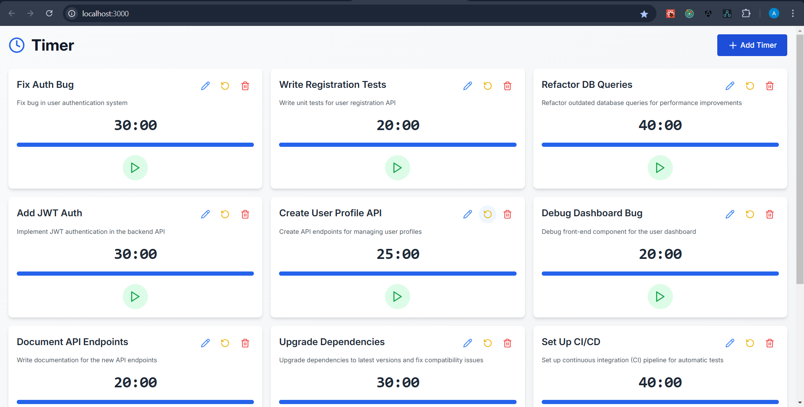
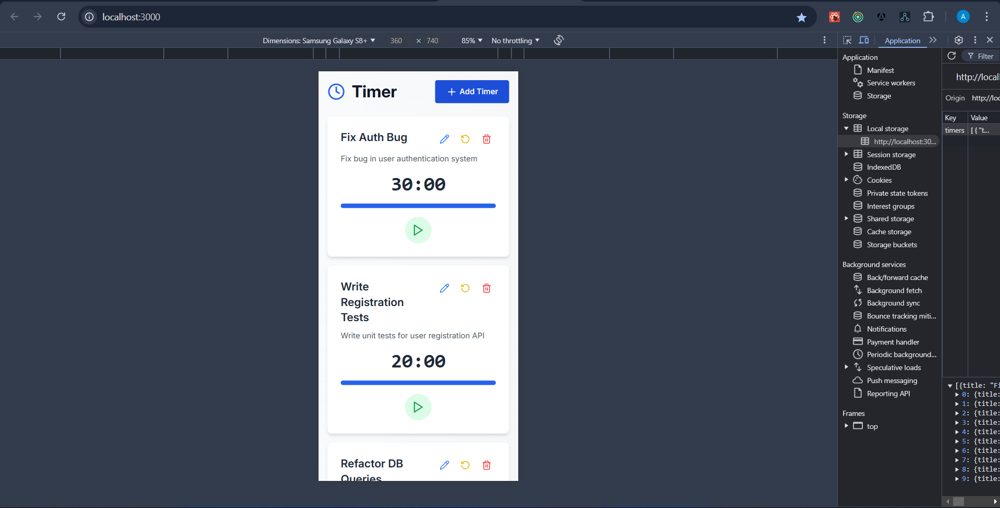
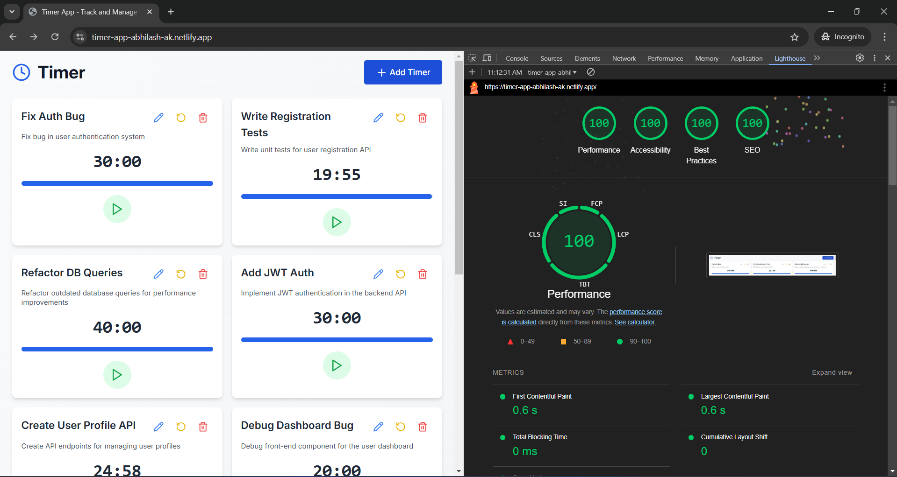

## 1. UI Matching:

Fix: Ensured the app's UI matches the provided screenshots.

Explanation: I examined the provided screenshots and adjusted the layout, fonts, and color scheme to match the visual design requirements. Tailwind CSS was used to ensure responsiveness and alignment, matching the UI for both desktop and mobile views.

## 2. Simultaneous Timers:

Fix: Updated the app to allow multiple timers to run simultaneously.

Explanation: The original code only allowed one timer to run at a time. I refactored the logic to handle multiple timers, managing them independently with React state. Each timer now operates on its own, allowing for better user experience when managing multiple timers.

## 3. Snack Bar Behavior:

Fix: Implemented a snack bar notification system that keeps the notification sound playing until dismissed.

Explanation: When a timer completes, a snack bar is displayed. The sound continues to play until the user clicks the dismiss button. I utilized the toast package to handle notifications and ensured the audio played in sync with the notification.

## 4. Fix Snack Bar Console Error:

Fix: Fixed the console error that occurred when the snack bar's dismiss button was clicked.

Explanation: The error was caused by improper cleanup of the audio interval when the snack bar was dismissed. I added logic to stop the audio and clear the interval once the dismiss button was clicked.

## 5. Extract Common Components:

Fix: Extracted the buttons in the Add/Edit Timer Modal as a reusable component.

Explanation: I identified repeated button components in the modal and created a reusable ModalButtons component. This reduced code duplication, making the code more modular and maintainable.

## 6. Consolidate Modal Code:

Fix: Refactored the modal components to use a single modal for both adding and editing timers.

Explanation: Instead of having separate modal components for adding and editing timers, I consolidated them into a single reusable modal component. Conditional rendering handles different actions (add/edit), reducing redundancy and simplifying the code.

## 7. Validation Snack Bars:

Fix: Showed an error snack bar when the form is submitted with invalid data.

Explanation: Rather than disabling the submit button when the form is invalid, I now show an error snack bar when the form is submitted with invalid data. This provides more informative feedback to users.

## 8. Responsive Snack Bar Placement:

Fix: Adjusted the placement of snack bars based on the device type.

Explanation: On desktop devices, snack bars are displayed in the top-right corner. On mobile devices, they appear at the bottom of the screen. This ensures the snack bars are appropriately placed for different screen sizes, improving the user experience.

## 9. Write Tests:

Fix: Added unit tests for the validation logic and component tests for reusable components.

Explanation: I wrote tests for the validation logic in validation.ts to ensure that all validation rules are working as expected. Additionally, I wrote tests for the TimerItem and ModalButtons components to ensure they render and function correctly.

## 10. Timer Persistence:

Fix: Implemented localStorage to persist timers across page refreshes.

Explanation: I used localStorage to store timers so that their state persists even after a page refresh. This ensures that the timers remain intact and functional, providing a seamless user experience across sessions.

# Performance

